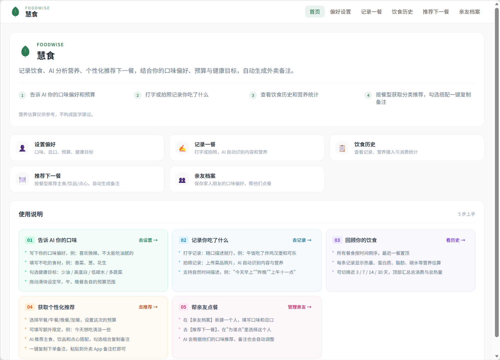
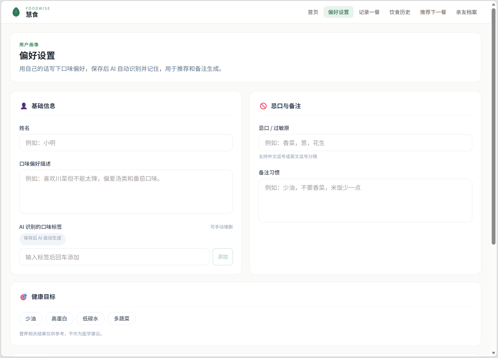
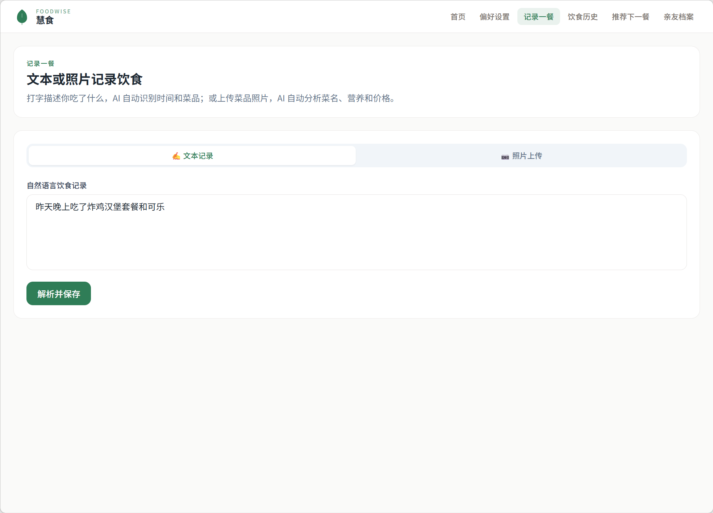
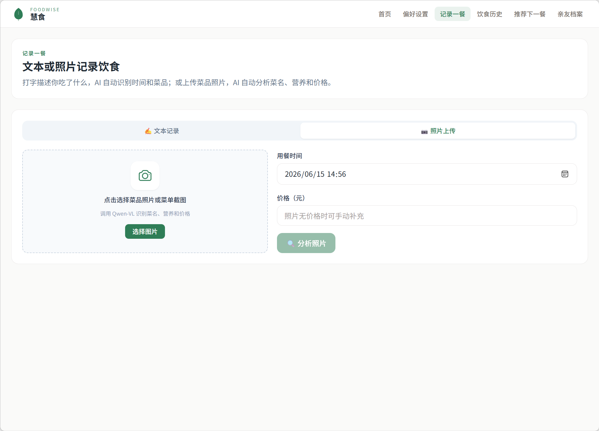
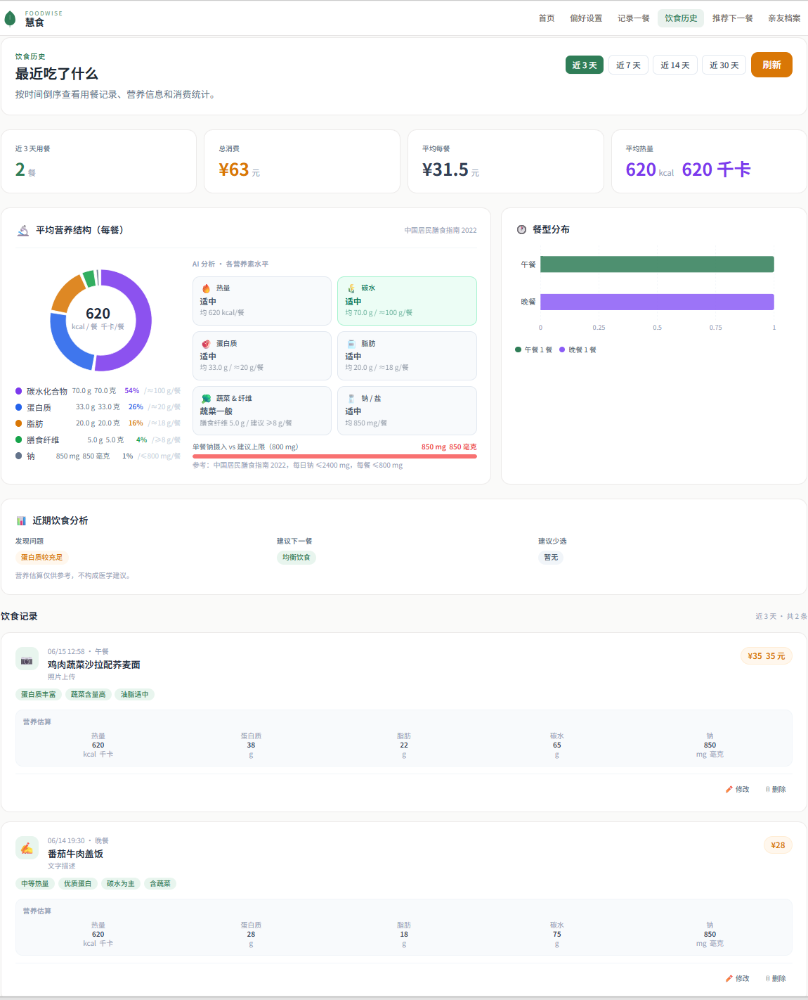
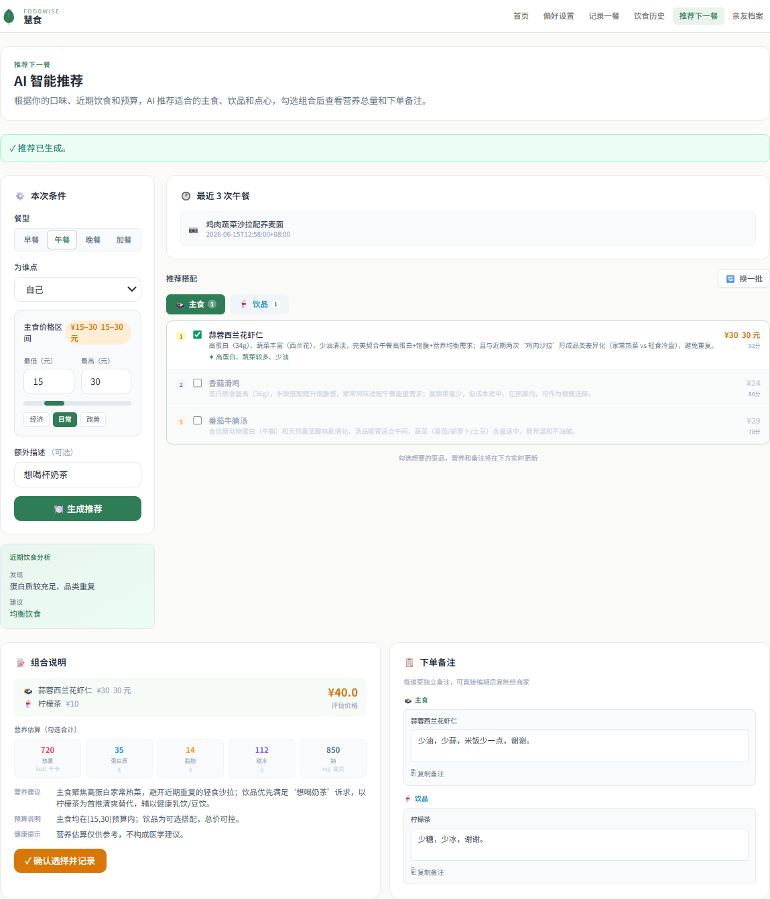
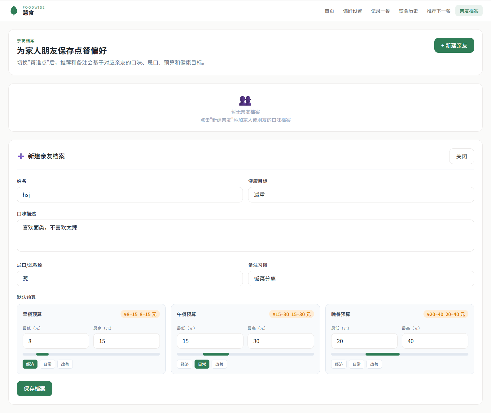

# 慧食 FoodWise

基于多模态大模型的个性化饮食管理与外卖推荐系统。支持自然语言或照片记录饮食，结合用户画像、忌口、预算和近期饮食历史，推荐下一餐并生成可一键复制的外卖备注。

---

## 安装

**前置依赖：** [Miniconda](https://docs.conda.io/en/latest/miniconda.html) · Node.js 18+ · DashScope API Key

```bash
# 1. 创建 Python 环境并安装依赖（项目根目录执行）
conda create -n foodwise python=3.10 -y
conda activate foodwise
pip install -r requirements.txt

# 2. 安装前端依赖
cd frontend && npm install && cd ..
```

## 配置

创建 `backend/config/llm_config.json`：

```json
{
  "dashscope_base_url": "https://dashscope.aliyuncs.com/compatible-mode/v1",
  "api_key": "你的 DashScope API Key",
  "qwen_vl_model": "qwen-vl-plus",
  "qwen_text_model": "qwen-plus",
  "use_mock_llm": false
}
```

> `use_mock_llm: true` 为开发调试模式，跳过真实 API 调用，无需 Key。

## 运行

```bash
bash start.sh
```

启动后访问 **http://localhost:5173**（前端代理 `/api` → `http://localhost:5000`）。

## 测试

```bash
conda activate foodwise
cd backend
pytest tests/ -v
```

13 个测试文件，67 个用例，覆盖数据库、时间解析、推荐算法、备注生成和全链路联调。

---

## 界面说明

### 首页



进入系统的导航中心。

| 区域 | 说明 |
|------|------|
| 品牌区 | 展示 FoodWise / 慧食 Logo 和项目一句话介绍 |
| **设置偏好** | 跳转到用户画像页，配置口味、忌口、预算和健康目标 |
| **记录一餐** | 跳转到饮食记录页，文字或照片记录今天吃了什么 |
| **饮食历史** | 跳转到历史页，查看近期记录和营养消费统计 |
| **推荐下一餐** | 跳转到推荐页，AI 结合画像和历史给出下一餐建议 |
| **亲友档案** | 跳转到亲友管理页，为家人朋友保存点餐偏好 |
| 使用说明 | 页面下方的 5 步引导，帮助初次使用的用户快速了解完整流程 |

---

### 偏好设置



配置个人口味画像，推荐和备注生成均依赖此页数据。

| 字段 | 说明 |
|------|------|
| 姓名 | 可选，用于个性化展示 |
| 口味偏好描述 | 自由文字输入，如"喜欢微辣，偏爱汤类和番茄口味"；保存后 AI 自动解析为结构化标签 |
| AI 识别的口味标签 | 由大模型从口味描述提取，支持手动增删 |
| 忌口 / 过敏原 | 逗号或空格分隔，推荐时会强制过滤含这些食材的菜品 |
| 备注习惯 | 每次下单固定要写的备注，如"少油，不要香菜"，会自动合并进备注生成 |
| 健康目标 | 少油 / 高蛋白 / 低碳水 / 多蔬菜，多选，影响推荐打分权重 |
| 默认预算 | 按早 / 午 / 晚餐分别设置价格区间（下滑可见），预填到推荐页的价格滑块 |
| **保存** | 提交所有配置，口味标签由后端 LLM 实时解析后写入数据库 |

---

### 记录一餐 — 文本模式



用自然语言描述一餐，AI 自动解析时间、菜品和营养。

| 元素 | 说明 |
|------|------|
| **文本记录** 标签页 | 当前激活的输入模式 |
| **照片上传** 标签页 | 切换到拍照识别模式（见下节） |
| 输入框 | 自然语言描述，支持相对时间，如"昨天晚上吃了炸鸡汉堡套餐和可乐" |
| **解析并保存** | 调用千问文本模型解析时间、菜品名、营养和价格，校验时间后写入数据库；`time_resolution` 为 unknown 时会提示补充时间 |

---

### 记录一餐 — 照片模式



上传菜品照片或菜单截图，AI 自动识别菜名和营养。

| 元素 | 说明 |
|------|------|
| 上传区域 | 点击或拖拽选择图片，支持菜品实物照片或外卖截图 |
| **选择图片** | 打开文件选择器 |
| 用餐时间 | 默认当前时间，可手动修改 |
| 价格（元） | 照片无法识别价格时可手动补充 |
| **分析照片** | 调用千问 VL 多模态模型识别菜品名称、食材、营养信息和价格，返回结果后在右侧展示确认 |

---

### 饮食历史



查看历史记录和近期营养 / 消费统计。

| 元素 | 说明 |
|------|------|
| **近 3 天 / 7 天 / 14 天 / 30 天** | 切换统计时间窗口，所有图表和数据同步刷新 |
| **刷新** | 重新拉取最新数据 |
| 统计卡片 | 依次展示：用餐次数、总消费（元）、平均每餐消费、平均每餐热量（千卡） |
| 平均营养结构图 | 饼图展示碳水 / 蛋白质 / 脂肪 / 膳食纤维 / 钠的占比，右侧对照中国居民膳食指南 2022 参考值，高亮超标项 |
| 餐型分布 | 水平条形图，展示午餐 / 晚餐等各餐次的频次比例 |
| 近期饮食分析 | AI 分析近期饮食规律，给出"发现 / 建议下一餐多吃 / 建议少选"三栏提示，直接传递给推荐引擎 |
| 饮食记录列表 | 按时间倒序展示每条记录：餐次图标、菜品名称、营养标签、五项营养数值表、价格 |
| **修改** | 编辑该条饮食记录 |
| **删除** | 删除该条记录（不可恢复） |

---

### 推荐下一餐



核心功能页，AI 综合画像、历史和预算给出主食 / 饮品 / 点心搭配推荐。

**左侧条件面板**

| 元素 | 说明 |
|------|------|
| 餐型 | 早餐 / 午餐 / 晚餐 / 加餐，决定推荐时段和预算默认值 |
| 为谁点 | 下拉选择自己或已创建的亲友，切换后使用对应画像和忌口 |
| 主食价格区间 | 双端滑块 + 数字输入框，仅对主食生效；饮品 / 点心为附加项不受约束 |
| **经济 / 日常 / 改善** | 快捷预设价格区间按钮 |
| 额外选填 | 本次额外想吃的东西（如"想喝奶茶"），传入 LLM 推理 |
| **生成推荐** | 触发完整推荐链路：读取画像 → 分析近期饮食 → 规则预筛 Top 10 → LLM 推理 Top 3 → 生成备注 |
| 近期饮食分析 | 推荐生成后展示 AI 对近期饮食的判断（如"蔬菜量较少、蛋白质较足"），说明本次推荐的补偿逻辑 |

**右侧结果面板**

| 元素 | 说明 |
|------|------|
| 最近 3 次用餐 | 展示同餐型的近期记录，供参考避免重复 |
| **主食 / 饮品 / 点心** 标签页 | 分类展示推荐结果，每类最多 3 个候选 |
| 菜品卡片 | 显示菜名、推荐理由、营养亮点和价格；勾选复选框纳入本次组合 |
| **换一批** | 排除当前推荐的菜品，重新调用 LLM 生成新候选 |
| 组合说明 | 展示已勾选菜品的总价、合计营养（热量 / 蛋白质 / 脂肪 / 碳水 / 钠）和 LLM 综合推理说明 |
| 下单备注 | 每道已勾选菜品各有一段独立备注（由 LLM 根据忌口 + 菜品类别生成），可直接编辑 |
| **复制** | 一键复制该菜品备注到剪贴板，粘贴到外卖 App 备注栏 |
| **确认选择记录** | 将本次推荐和勾选结果写入推荐历史 |

---

### 亲友档案



为家人朋友保存独立的点餐偏好，推荐时可一键切换。

| 元素 | 说明 |
|------|------|
| 亲友列表 | 展示已创建的所有亲友档案，含姓名和口味摘要 |
| **+ 新建亲友** | 展开新建表单 |
| 姓名 | 档案标识，显示在推荐页"为谁点"下拉列表中 |
| 健康目标 | 该亲友的健康偏好，影响推荐打分 |
| 口味描述 | 自由文字描述，与个人偏好设置相同，AI 自动解析为标签 |
| 忌口 / 过敏原 | 推荐时对该亲友强制过滤含这些食材的菜品 |
| 备注习惯 | 该亲友固定的下单备注，合并进备注生成 |
| 默认预算 | 按早 / 午 / 晚餐分别设置，含**经济 / 日常 / 改善**快捷档位 |
| **保存档案** | 提交并写入数据库，之后在推荐页"为谁点"中可选 |
| **编辑 / 删除** | 修改或移除已有档案 |

---

## 项目结构

```
foodwise/
├── frontend/               # React 18 + Vite + Tailwind CSS
│   └── src/
│       ├── pages/          # Home / Profile / LogMeal / MealHistory / Recommend / Contacts
│       └── components/     # BrandLogo / BudgetSlider / PhotoUpload / NutritionCard / RemarkEditor
├── backend/                # Python 3.10 + Flask
│   ├── api/                # 路由层（profile / log_meal / meals / recommend / contacts）
│   ├── lib/                # 业务逻辑（llm / recommender / remark / nutrition / …）
│   ├── config/
│   │   └── llm_config.json # LLM 配置（gitignored）
│   ├── data/               # init_dishes.json + mealmate.db（运行时生成）
│   └── tests/              # 13 个测试文件，67 个用例
├── images/                 # 界面截图
├── docs/                   # 设计文档（spec / plan / tasks / prompts）
├── requirements.txt        # Python 依赖（版本锁定）
└── start.sh                # 一键启动脚本
```

## 技术栈

| 层面 | 技术 |
|------|------|
| 前端 | React 18 · Vite · Tailwind CSS · React Router DOM · recharts |
| 后端 | Python 3.10 · Flask · SQLite |
| 大模型 | Qwen-VL-Plus（图片识别）· Qwen-Plus（文本推理）|
| 测试 | pytest |

---

## AI 辅助开发记录

### 开发方式：Vibe Coding 分层协作

本项目采用"Vibe Coding"AI 辅助开发模式，将大模型能力按角色分工嵌入完整开发链路：

1. **需求对话（网页端 Claude）**：通过自然语言对话描述系统需求，由 Claude 制定详细执行计划、输出 SDD 文档（spec.md / plan.md / tasks.md）以及 Codex 分步实现提示词（codex_prompts.md）。
2. **框架实现（Codex）**：基于上一步产出的 Codex 提示词，由 Codex 5.5 完成前后端代码框架搭建、业务逻辑实现与完整测试，交付可运行的 MVP Demo。
3. **迭代优化（Claude Code）**：在 MVP 基础上，由 Claude Code（claude-sonnet-4.6）负责界面与功能优化、新功能追加、Bug 修复和端到端链路验证。

**人工职责：** 最终需求判断、业务规则确认、代码审查、手动验收测试、API Key 配置与 Demo 演示。

---

### 工具分工

| 工具 | 阶段 | 主要职责 |
|------|------|----------|
| 网页端 Claude | 规划 | 需求拆解、SDD 文档、执行计划、Codex 提示词生成 |
| Codex 5.5 | 实现 | 前后端框架代码、业务逻辑、13 个测试文件（67 个用例） |
| Claude Code（claude-sonnet-4.6）| 优化 | Bug 修复、功能扩展、菜品库扩充、推荐引擎增强、UI 问题排查 |

---

### 阶段一：规划与文档（网页端 Claude）

| 产出物 | 说明 |
|--------|------|
| `docs/spec.md` | 系统需求文档，含目标用户、核心痛点、功能范围与验收标准 |
| `docs/plan.md` | 技术选型与 8 个里程碑拆分（M1 骨架 → M8 收尾） |
| `docs/tasks.md` | 按里程碑细化的开发任务列表 |
| `docs/prompts.md` | 7 套千问大模型 Prompt 模板（图片识别、记录解析、推荐、备注生成等） |
| `codex_prompts.md` | Prompt A–N 共 14 个 Codex 分步实现提示词 |
| `AGENTS.md` | AI Agent 行为规范与约束说明 |

---

### 阶段二：MVP 框架实现（Codex 5.5）

Codex 按 codex_prompts.md 中的 14 个提示词分步完成以下工作：

| 模块 | 实现内容 |
|------|----------|
| 数据库层 | `lib/database.py`：6 张表（users / contacts / dishes / order_history / recommendation_records / notes_templates）、CRUD 封装、预置菜品导入 |
| LLM 封装 | `lib/llm.py`：千问 VL + 文本模型调用；`lib/mock_llm.py`：离线 Mock 模式 |
| 推荐引擎 | `lib/recommender.py`：规则预筛（基础分 50，加分/扣分/淘汰）；`lib/recommend.py`：LLM 推理 → 规则兜底完整链路 |
| 备注生成 | `lib/remark.py`：逐菜品 LLM 备注 + 规则兜底（忌口强制校验） |
| 时间解析 | `lib/time_parser.py`：LLM 返回 occurred_at 与 resolved_occurred_at 一致性校验 |
| 营养分析 | `lib/nutrition.py`：近期饮食聚合、营养分析摘要 |
| API 路由层 | `api/` 下 5 个 Blueprint：profile / log_meal / meals / recommend / contacts |
| 前端页面 | 6 个 React 页面（Home / Profile / LogMeal / MealHistory / Recommend / Contacts）+ 多个可复用组件 |
| 测试套件 | 13 个测试文件、67 个 pytest 用例，覆盖数据库、时间解析、LLM、推荐、备注、API 端到端 |
| 预置菜品 | `data/init_dishes.json`：初始 36 道菜，涵盖 9 个分类 |

---

### 阶段三：优化迭代（Claude Code）

#### 3.1 测试修复（3 个失败用例 → 全绿）

| 问题 | 根因 | 修复文件 |
|------|------|----------|
| `test_mock_generate_recommendation_returns_top_three` 断言 `total_estimated_price` | 该字段由 `recommend.py` 计算，非 LLM 返回，Mock 无此键 | `backend/tests/test_llm.py:76` |
| `test_prompts_contain_required_plan_constraints` 4 处字符串断言全部失败 | 实际 Prompt 文本与断言字符串不匹配（"只返回 JSON" vs "必须返回 JSON"、中文标点差异等） | `backend/tests/test_llm.py:138-145` |
| `test_generate_remarks_for_dishes_includes_habits` 断言备注含"少油" | Mock 的 `generate_remarks_for_dishes` 只拼接 `avoid_ingredients`，未包含 `remark_habits` | `backend/lib/mock_llm.py` |

#### 3.2 项目描述统一

将 7 个 Markdown 文件中的旧名称"个性化外卖推荐与智能备注系统/Agent"统一替换为"基于多模态大模型的个性化饮食管理与外卖推荐系统"，保留"基于多模态大模型的"前缀。

涉及文件：`README.md` · `AGENTS.md` · `FoodWise_Final_Plan.md` · `codex_prompts.md` · `docs/spec.md` · `docs/plan.md` · `docs/prompts.md`

#### 3.3 Git 仓库整理

- 清理历史提交，以单一 `init` commit 推送至 GitHub
- 本地及远端分支 `master` → `main`（修改 GitHub 默认分支后删除远端 master）

#### 3.4 菜品库扩充

将 `data/init_dishes.json` 从 **36 道**扩充至 **61 道**，每个分类由 4 道增至 6–8 道，新增菜品示例：

| 分类 | 新增菜品 |
|------|----------|
| 盖饭类 | 红烧肉饭、宫保鸡丁饭、猪脚饭、梅菜扣肉饭 |
| 粉面类 | 重庆小面、担担面、炒河粉 |
| 轻食类 | 三明治套餐、水果燕麦碗 |
| 快餐油炸类 | 炸猪排饭、披萨（芝士牛肉） |
| 麻辣类 | 辣子鸡、红油抄手、干锅花菜 |
| 汤粥类 | 猪肚鸡汤、绿豆汤 |
| 家常菜类 | 红烧排骨、清蒸鲈鱼、回锅肉 |
| 面点类 | 虾饺、葱油拌面、韭菜盒子 |
| 饮料类 | 珍珠奶茶、绿茶、热牛奶 |

扩充后执行 `init_db()` 重新导入，无需重启后端即时生效。

#### 3.5 推荐引擎增强：LLM 自由推荐

原推荐链路强制要求 LLM 只能从候选菜品列表（DB 预筛结果）中选取。改造后 LLM 可自由推荐候选列表之外的菜品。

**改动文件：**

- `backend/lib/llm.py`：`RECOMMENDATION_SYSTEM_PROMPT` 移除"dish_id 和 name 必须来自候选菜品列表"约束，改为"优先从候选中推荐；不足时可自由推荐，dish_id 填 `""`，并提供 category / ingredients / price"
- `backend/lib/recommend.py`：`_sanitize_llm_recommendations` 新增自由推荐分支——候选列表找不到时不再跳过，而是创建带 `is_llm_free: true` 标记的虚拟菜品字典；同时检查菜名是否在 DB 全量菜品中存在（若存在说明是被过滤掉的忌口/超预算菜，依然拒绝）
- `backend/lib/recommend.py`：`_candidate_for_recommendation` 新增虚拟菜品兜底，从推荐条目本身重建菜品字典，保证备注生成和价格汇总正常工作

**同步修复（回归测试）：** 新增路径导致被忌口过滤的菜品可能借自由推荐渠道重新进入结果，通过 `all_dishes` 名称双重校验堵住该漏洞；测试断言 `len(dishes) <= 50` 更新为 `>= 60`。67 个用例持续全绿。

#### 3.6 推荐页餐型切换 Bug 修复

**现象：** 在推荐页已生成推荐结果后切换餐型（早/午/晚/加餐），"最近 3 次 X 餐"区域仍显示上一次推荐的旧数据。

**根因：** `recentMeals` 优先取 `result.recent_meals_same_type`；切换餐型时只刷新了 `mealsByType`（API 重新拉取），但 `result` 状态未清空，旧数据持续覆盖新数据。

**修复：** `Recommend.jsx` 餐型切换按钮的 `onClick` 中补充 `setResult(null); setRemarks([]); setCheckedIds(new Set()); setExcludeIds([]);`，与切换用户（`target`）时的行为保持一致。

---

## 测试结果

**测试命令：**

```bash
conda activate foodwise
cd backend
pytest tests/ -v
```

**测试结果（2026-06-15）：67 个用例，全部通过**

```
============================= 67 passed in 25.05s ==============================
```

| 测试文件 | 用例数 | 覆盖内容 |
|----------|--------|----------|
| test_database.py | 8 | 用户 / 餐食 / 菜品 / 推荐记录 CRUD |
| test_llm.py | 9 | Mock LLM 返回结构、LLM 配置加载、Prompt 约束 |
| test_log_meal_api.py | 5 | 文本记录 API 端到端（时间解析、营养字段校验） |
| test_nutrition.py | 6 | 营养聚合、分析摘要、饮食模式判断 |
| test_photo_api.py | 4 | 照片上传识别 API（mock 路径） |
| test_profile_api.py | 4 | 偏好设置 API（口味标签解析、保存读取） |
| test_recommend_api.py | 7 | 推荐 API（过滤、预算、兜底、亲友切换） |
| test_recommender.py | 5 | 规则预筛排序、近期重复扣分 |
| test_remark.py | 8 | 备注规则生成、LLM 生成、兜底逻辑 |
| test_time_parser.py | 7 | 时间解析校验、餐次默认时间、排序 |
| test_contacts_api.py | 2 | 亲友档案 CRUD |
| test_full_demo_flow.py | 2 | 全链路联调（偏好→记录→历史→推荐→备注→确认） |
| conftest.py | — | 共享夹具（tmp_path DB、Flask test client） |

---

## 手动验收清单

以下功能已通过截图所示界面完成人工验收（对应 `images/` 目录截图）。

| 功能 | 验收点 | 截图 |
|------|--------|------|
| 首页导航 | 5 个功能入口按钮正常跳转；使用说明完整展示 | 01_首页.png |
| 偏好设置 | 口味描述保存后 AI 解析口味标签；忌口/备注习惯/健康目标/预算正常写入 | 02_偏好设置.png |
| 文本记录 | 自然语言输入后正确解析菜品名、时间（含相对时间推断）、营养信息并写入历史 | 03_记录一餐_文本.png |
| 照片记录 | 上传菜品图片后 AI 识别菜名、食材、营养；支持手动补充价格和时间 | 04_记录一餐_照片.png |
| 饮食历史 | 近 3/7/14/30 天切换正常；统计卡片、营养饼图、餐型分布、AI 分析均正确展示；支持修改和删除记录 | 05_饮食历史.png |
| 推荐下一餐 | 根据画像和预算生成主食/饮品推荐；换一批重新生成；备注含忌口和备注习惯；确认后写入历史 | 06_推荐下一餐.png |
| 亲友档案 | 新建/编辑/删除亲友档案；推荐页"为谁点"下拉可选；切换亲友后推荐结果不同 | 07_亲友档案.png |
